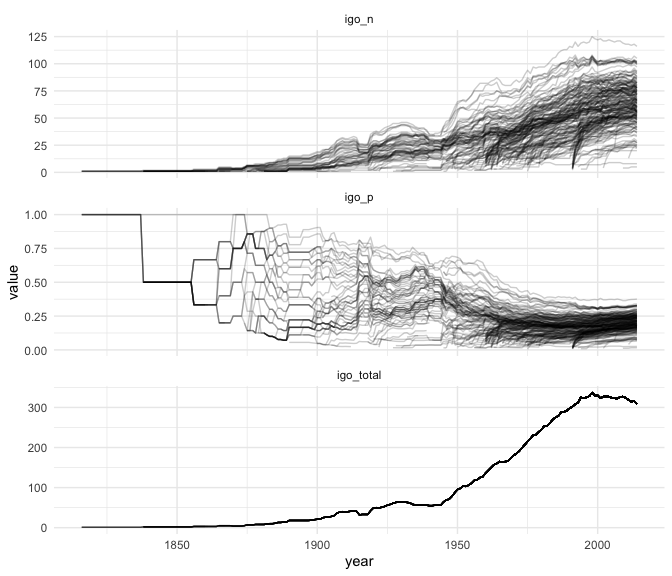

COW IGO state unit
================
12 August 2019

``` r
igo  <- read_csv("input/state_year_formatv3.csv")
```

    ## Parsed with column specification:
    ## cols(
    ##   .default = col_double(),
    ##   state = col_character()
    ## )

    ## See spec(...) for full column specifications.

``` r
cy   <- read_csv("input/cy-target-set.csv")
```

    ## Parsed with column specification:
    ## cols(
    ##   gwcode = col_double(),
    ##   year = col_double()
    ## )

``` r
dim(igo)
```

    ## [1] 15557   537

``` r
dplyr::glimpse(igo[, 1:10])
```

    ## Observations: 15,557
    ## Variables: 10
    ## $ ccode <dbl> 2, 2, 2, 2, 2, 2, 2, 2, 2, 2, 2, 2, 2, 2, 2, 2, 2, 2, 2, 2…
    ## $ year  <dbl> 1816, 1817, 1818, 1819, 1820, 1821, 1822, 1823, 1824, 1825…
    ## $ state <chr> "usa", "usa", "usa", "usa", "usa", "usa", "usa", "usa", "u…
    ## $ AAAID <dbl> -1, -1, -1, -1, -1, -1, -1, -1, -1, -1, -1, -1, -1, -1, -1…
    ## $ AACB  <dbl> -1, -1, -1, -1, -1, -1, -1, -1, -1, -1, -1, -1, -1, -1, -1…
    ## $ AALCO <dbl> -1, -1, -1, -1, -1, -1, -1, -1, -1, -1, -1, -1, -1, -1, -1…
    ## $ AARO  <dbl> -1, -1, -1, -1, -1, -1, -1, -1, -1, -1, -1, -1, -1, -1, -1…
    ## $ AATA  <dbl> -1, -1, -1, -1, -1, -1, -1, -1, -1, -1, -1, -1, -1, -1, -1…
    ## $ AATPO <dbl> -1, -1, -1, -1, -1, -1, -1, -1, -1, -1, -1, -1, -1, -1, -1…
    ## $ ABEDA <dbl> -1, -1, -1, -1, -1, -1, -1, -1, -1, -1, -1, -1, -1, -1, -1…

``` r
range(igo$year)
```

    ## [1] 1816 2014

``` r
range(cy$year)
```

    ## [1] 1995 2005

Collapse this mother in some fashion. We can check how many IGOs a state
was a member of in any given year. Another question, how many IGOs were
there in each year?

First, check values:

``` r
igo %>%
  select(-state) %>%
  gather(igo, status, -ccode, -year) %>%
  count(status)
```

    ## # A tibble: 6 x 2
    ##   status       n
    ##    <dbl>   <int>
    ## 1     -9  138874
    ## 2     -1 5459286
    ## 3      0 2170313
    ## 4      1  535772
    ## 5      2     861
    ## 6      3    2332

\-9 is missing, -1 is not independent states; 1 is full membership, 2
and 3 are associate membership and observer.

How many IGOs per year? Consider only full membership.

``` r
igo_long <- igo %>%
  select(-state) %>%
  gather(igo, status, -ccode, -year) %>%
  filter(status == 1)
```

``` r
n_igos <- igo_long %>% 
  group_by(year) %>% 
  summarize(N_IGOs = length(unique(igo)))

ggplot(n_igos, aes(x = year, y = N_IGOs)) +
  geom_line() +
  theme_minimal()
```

<!-- -->

Collapse into number of IGOs a state was member of.

``` r
igo <- igo_long %>%
  group_by(ccode, year) %>%
  count(ccode, year, name = "igo_n") %>%
  left_join(n_igos, by = "year") %>%
  rename(igo_total = N_IGOs) %>%
  ungroup() %>%
  mutate(igo_p = igo_n / igo_total)
```

``` r
igo %>% 
  gather(var, value, -ccode, -year) %>% 
  mutate(year  = as.Date(sprintf("%s-01-01", year)),
         spell = id_date_sequence(year, "year"),
         ccode_id = sprintf("%s-%s", ccode, spell),
         year  = as.integer(year(year))) %>%
  ggplot(aes(x = year, y = value, group = ccode_id)) + 
  facet_wrap(~ var, scales = "free_y", ncol = 1) + 
  geom_line(alpha = .2) +
  theme_minimal()
```

<!-- -->

``` r
df <- igo %>% 
  filter(year > 1950) %>%
  mutate(ccode = ifelse(ccode==255 & year > 1988, 260L, ccode)) %>%
  arrange(ccode, year) %>%
  mutate(year  = as.Date(sprintf("%s-01-01", year)),
         spell = id_date_sequence(year, "year"),
         ccode_id = sprintf("%s-%s", ccode, spell),
         year  = as.integer(year(year)))

ggplot(df, aes(x = year, y = igo_n, group = ccode_id)) + 
  geom_line(alpha = .15) +
  geom_line(data = df[df$ccode %in% c(2, 260, 366), ], 
            aes(color = factor(ccode)), 
            size = 1) +
  theme_minimal() +
  scale_x_continuous(breaks = seq(1950, 2010, by = 10)) +
  labs(y = "# of IGOs member of", x = "") +
  scale_color_brewer("", type = "qual", palette = 6,
                     labels = c("2" = "USA",
                                "260" = "Germany",
                                "366" = "Estonia")) +
  theme(legend.position = "top")
```

<!-- -->

``` r
ggplot(df, aes(x = year, y = igo_p, group = ccode_id)) + 
  geom_line(alpha = .15) +
  geom_line(data = df[df$ccode %in% c(2, 260, 366), ], 
            aes(color = factor(ccode)),
            size = 1) +
  theme_minimal() +
  scale_x_continuous(breaks = seq(1950, 2010, by = 10)) +
  labs(y = "fraction of IGOs member of", x = "") +
  scale_color_brewer("", type = "qual", palette = 6,
                     labels = c("2" = "USA",
                                "260" = "Germany",
                                "366" = "Estonia")) +
  theme(legend.position = "top")
```

<!-- -->

## Set overlap

Check country-year ID set overlap before merge.

``` r
igo <- igo %>%
  filter(year %in% unique(cy$year))

igo_set <- igo[, c("ccode", "year")] %>%
  mutate(in_igo = TRUE)
cy_set   <- cy %>%
  mutate(in_cy = TRUE)
full_set <- full_join(igo_set, cy_set, 
                      by = c("ccode" = "gwcode", "year" = "year")) %>%
  replace_na(list(in_cy = FALSE, in_igo = FALSE))

full_set %>% 
  group_by(in_igo, in_cy) %>%
  count()
```

    ## # A tibble: 3 x 3
    ## # Groups:   in_igo, in_cy [3]
    ##   in_igo in_cy     n
    ##   <lgl>  <lgl> <int>
    ## 1 FALSE  TRUE     22
    ## 2 TRUE   FALSE   456
    ## 3 TRUE   TRUE   1632

Don’t need to worry about (TRUE, FALSE), the (FALSE, TRUE) are a
problem. Cases in `cy` that are missing in IGO. Check which countries
and years.

``` r
full_set %>%
  filter(in_igo==FALSE & in_cy==TRUE) %>%
  group_by(ccode) %>%
  summarize(year = paste0(year, collapse = ";"))
```

    ## # A tibble: 2 x 2
    ##   ccode year                                                  
    ##   <dbl> <chr>                                                 
    ## 1   260 1995;1996;1997;1998;1999;2000;2001;2002;2003;2004;2005
    ## 2   678 1995;1996;1997;1998;1999;2000;2001;2002;2003;2004;2005

Post-1990 Germany and Yemen. This is a standard G\&W / COW divergence.
Recode.

``` r
igo <- igo %>%
  mutate(ccode = case_when(
    ccode==255 ~ 260L,
    ccode==679 ~ 678L,
    TRUE ~ as.integer(ccode)
  )) %>%
  rename(gwcode = ccode) %>%
  mutate(in_igo = TRUE) %>%
  full_join(cy_set, by = c("gwcode", "year")) %>%
  filter(in_igo | in_cy)
```

``` r
check <- igo %>%
  group_by(in_igo, in_cy) %>%
  count()

if (any(is.na(igo$in_igo))) {
  stop("IGO is missing some needed cases")
}
```

We can drop the excess GMFD cases.

``` r
igo <- igo %>%
  filter(in_cy) %>%
  select(-in_igo, -in_cy)
```

``` r
write_csv(igo, "output/igo.csv")
```
