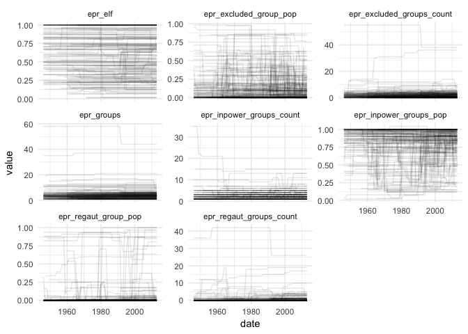

Ethnic Power Relations (EPR)
================

Download and get EPR data.

Usage
-----

``` r
library("dplyr")
library("readr")
library("tidyr")
library("states")

library("ggplot2")
library("tidyr")

source("epr.R")

example <- epr_api(what = "raw")
str(example)
```

    ## Classes 'tbl_df', 'tbl' and 'data.frame':    4292 obs. of  11 variables:
    ##  $ gwcode   : int  2 2 2 2 2 2 2 2 2 2 ...
    ##  $ statename: chr  "United States" "United States" "United States" "United States" ...
    ##  $ from     : int  1946 1946 1946 1946 1946 1946 1966 1966 1966 1966 ...
    ##  $ to       : int  1965 1965 1965 1965 1965 1965 2008 2008 2008 2008 ...
    ##  $ group    : chr  "Whites" "Latinos" "African Americans" "Asian Americans" ...
    ##  $ groupid  : int  1000 2000 3000 4000 5000 6000 1000 2000 3000 4000 ...
    ##  $ gwgroupid: int  201000 202000 203000 204000 205000 206000 201000 202000 203000 204000 ...
    ##  $ umbrella : chr  NA NA NA NA ...
    ##  $ size     : num  0.691 0.125 0.124 0.036 0.0078 0.0042 0.691 0.125 0.124 0.036 ...
    ##  $ status   : chr  "MONOPOLY" "IRRELEVANT" "DISCRIMINATED" "IRRELEVANT" ...
    ##  $ reg_aut  : chr  "missing" "missing" "false" "missing" ...

``` r
example <- epr_api(what = "monthly")
str(example)
```

    ## 'data.frame':    10340 obs. of  11 variables:
    ##  $ gwcode                   : int  2 2 2 2 2 2 2 2 2 2 ...
    ##  $ date                     : Date, format: "1946-01-01" "1947-01-01" ...
    ##  $ year                     : num  1946 1947 1948 1949 1950 ...
    ##  $ epr_groups               : int  6 6 6 6 6 6 6 6 6 6 ...
    ##  $ epr_elf                  : num  0.51 0.51 0.51 0.51 0.51 ...
    ##  $ epr_excluded_groups_count: int  2 2 2 2 2 2 2 2 2 2 ...
    ##  $ epr_excluded_group_pop   : num  0.132 0.132 0.132 0.132 0.132 ...
    ##  $ epr_inpower_groups_count : int  4 4 4 4 4 4 4 4 4 4 ...
    ##  $ epr_inpower_groups_pop   : num  0.856 0.856 0.856 0.856 0.856 ...
    ##  $ epr_regaut_groups_count  : int  1 1 1 1 1 1 1 1 1 1 ...
    ##  $ epr_regaut_group_pop     : num  0.0078 0.0078 0.0078 0.0078 0.0078 0.0078 0.0078 0.0078 0.0078 0.0078 ...

``` r
example %>%
  gather(var, value, -gwcode, -date, -year) %>%
  ggplot(aes(x = date, y = value, group = gwcode)) +
  facet_wrap(~ var, scales = "free_y") +
  geom_line(alpha = .1) +
  theme_minimal()
```

    ## Warning: Removed 7215 rows containing missing values (geom_path).



Write CSV for the old legacy file-based system.

``` r
epr_legacy_csv()
```
