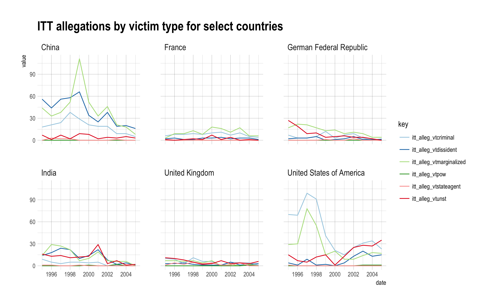
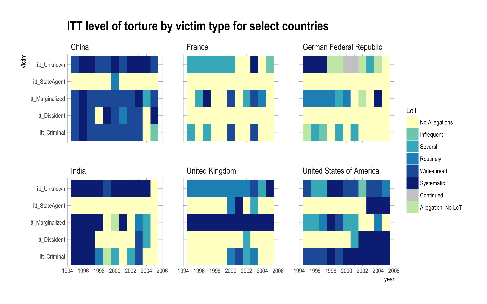
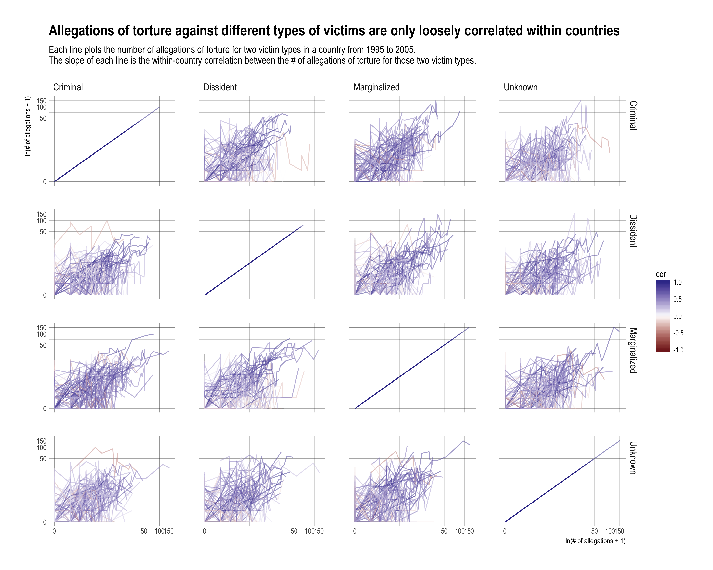
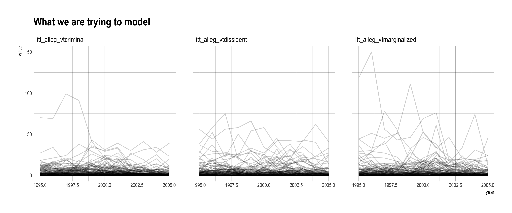
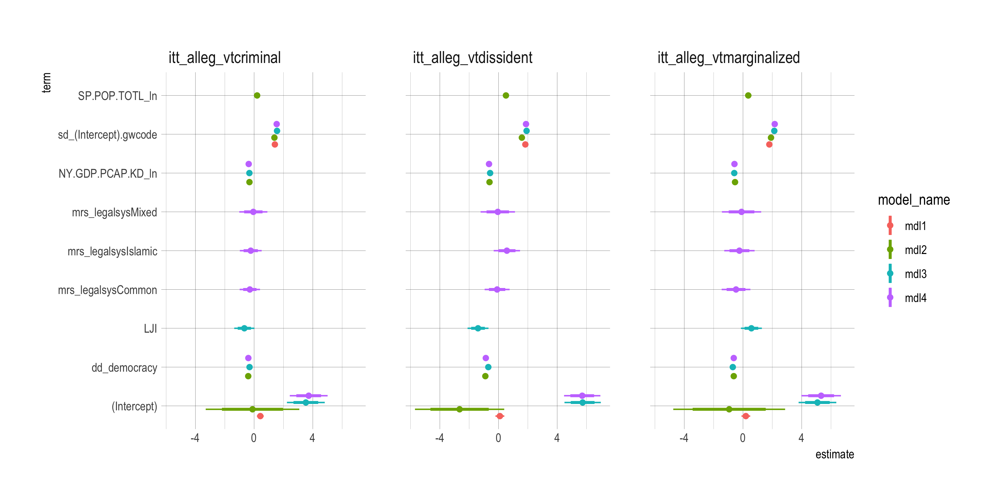
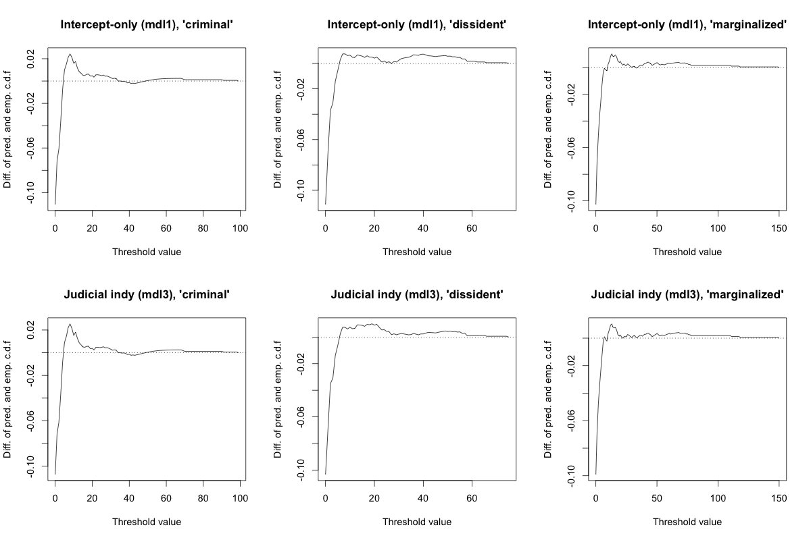
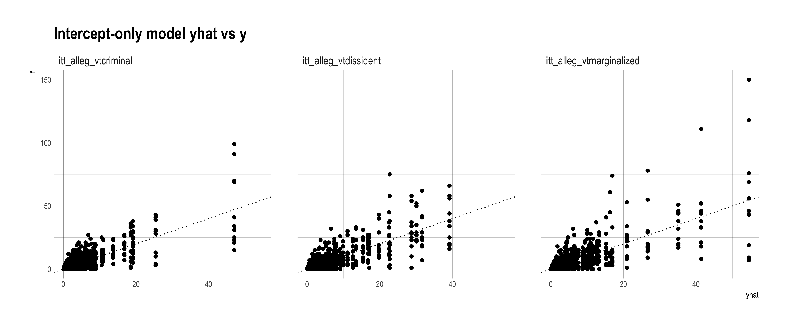
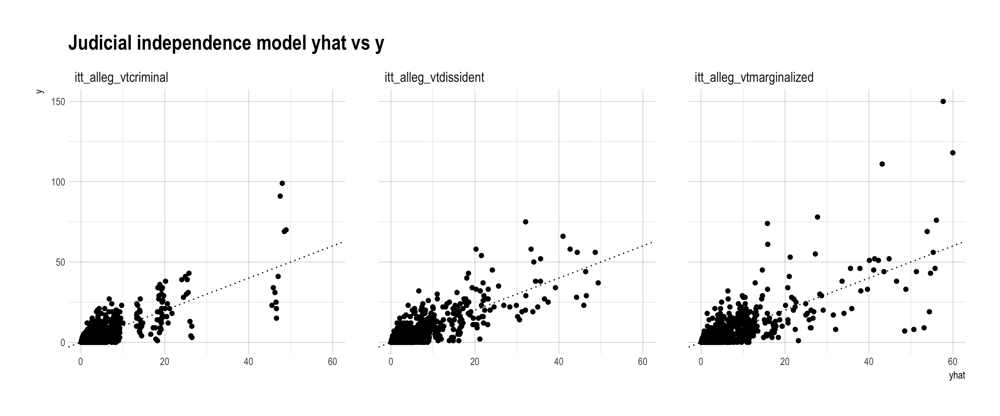
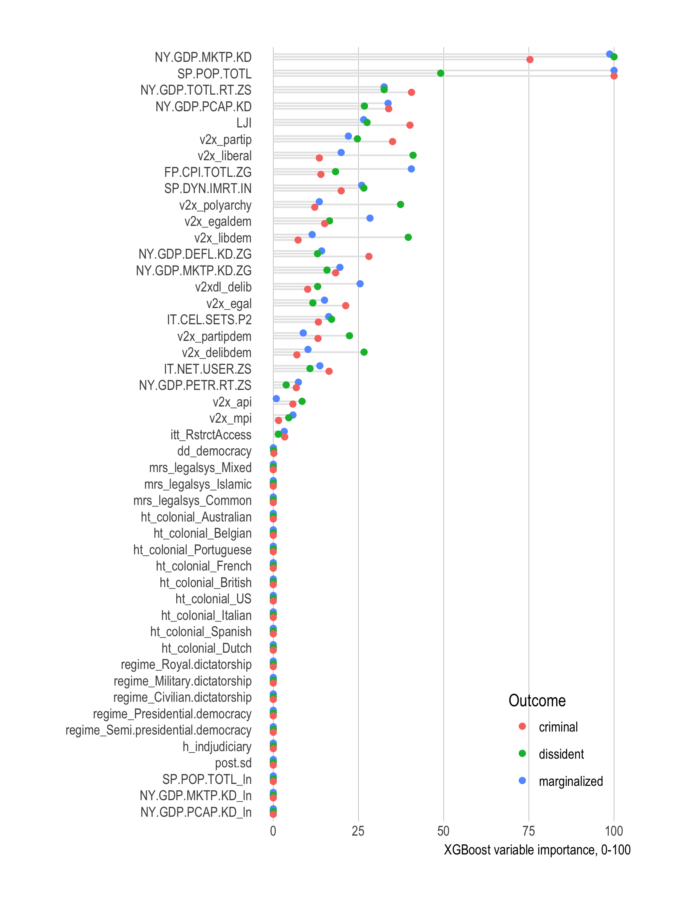

```{r setup, include=FALSE}
knitr::opts_chunk$set(echo = FALSE)

library("tidyverse")
```


Data: country-years from 1995 to 2005, which is the limit of ITT data coverage. There are 152 unique countries (G&W codes). The number of observation is about 1600. 









The plot is meant to show that while allegation of torture against different victim types within a country are generally positively correlated, there is substantial variation around this broader trend. In other words, not all countries that torture criminal or marginalized groups also torture dissidents. 

# Modeling





Coefficient estimates from 4 models. All are Poisson count models and include country random effects. The first model has intercepts only, second adds GDP per capita and a binary indicator for democracy, derived from Cheibub, Gandhi, and Vreeland. The third and fourth models add latent judicial independence and legal system dummies, respectively. 

In the fit table, note that the fit statistics for XGBoost are out of sample, while those for the count models are in sample. 

```{r}
res1 <- read_csv("output/count-model-fit.csv", 
         col_types = cols(
           outcome = col_character(),
           model_name = col_character(),
           AIC = col_double(),
           BIC = col_double(),
           MAE = col_double(),
           RMSE = col_double()
         )) 
res2 <- read_csv("output/xgboost-fit.csv",
                 col_types = cols(
                   outcome = col_character(),
                   model_name = col_character(),
                   MAE = col_double(),
                   RMSE = col_double()
                 ))
res <- bind_rows(res1, res2) 
res %>% 
  arrange(outcome, model_name) %>%
  knitr::kable(digits = 2)
  
```









