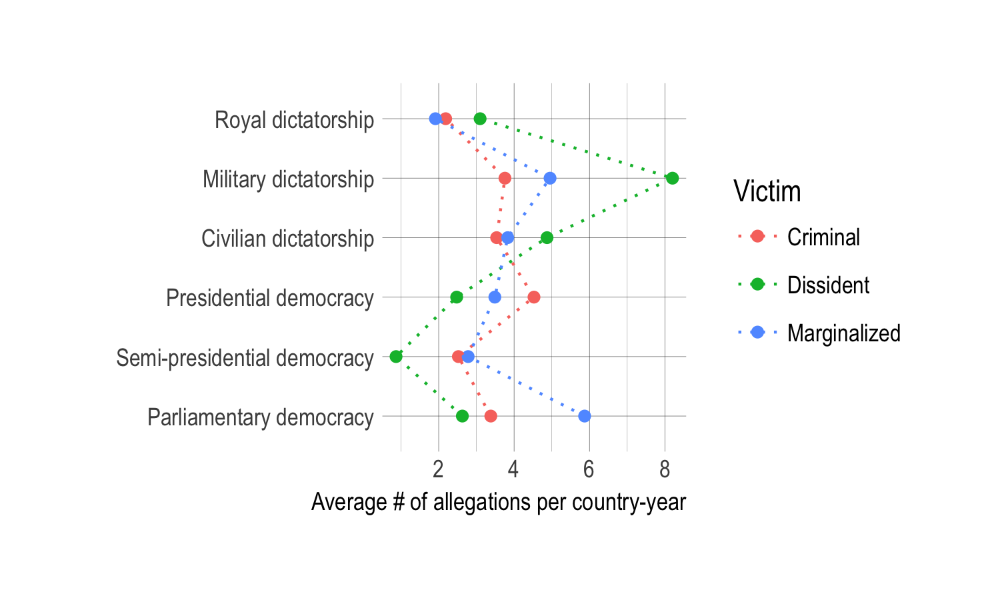
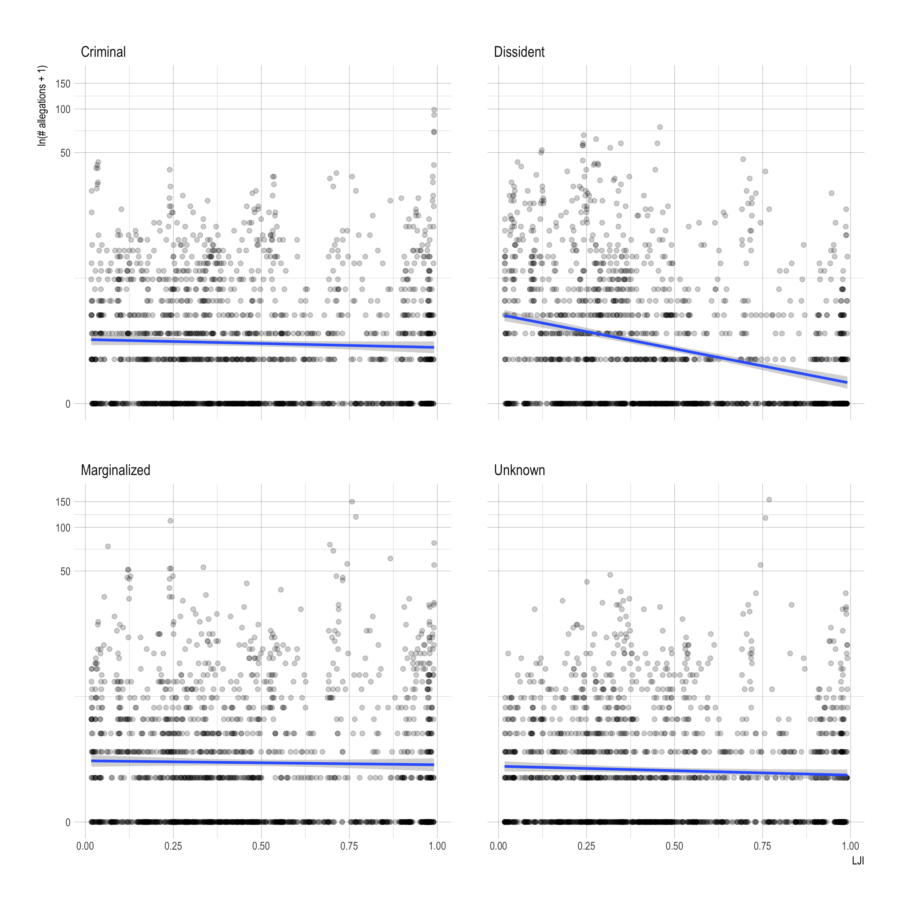

```{r setup, include=FALSE}
knitr::opts_chunk$set(echo = FALSE)
```

## Countries torture different victim types


## Democracy



- Democracies have lower levels of allegations | wealth, random intercept

## Judicial independence



